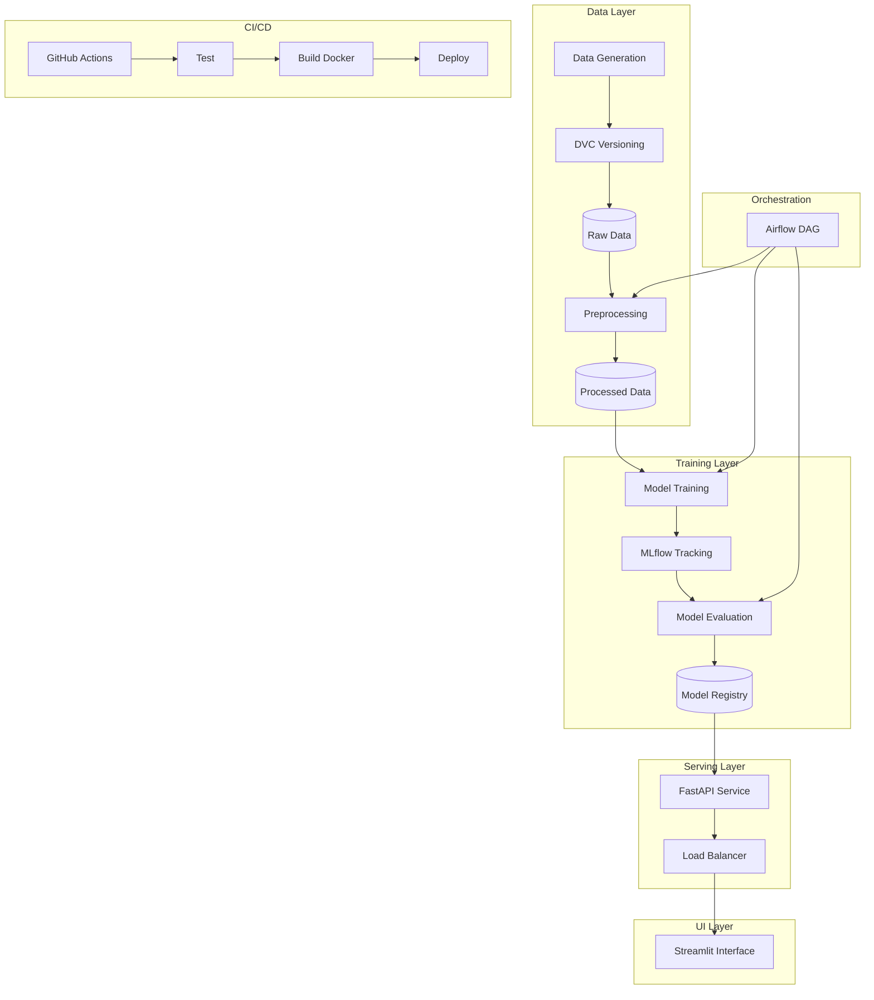

# MLOps Architecture

## System Overview

This document provides a detailed view of the Student Placement Prediction MLOps System architecture.

---

## High-Level Architecture



---

## Component Details

### 1. Data Pipeline

```
┌─────────────────┐
│ Data Generation │
│  (Synthetic)    │
└────────┬────────┘
         │
         v
┌─────────────────┐
│   DVC Track     │
│  Version Control│
└────────┬────────┘
         │
         v
┌─────────────────┐
│ Preprocessing   │
│ - Scaling       │
│ - Splitting     │
└────────┬────────┘
         │
         v
┌─────────────────┐
│ Train/Test Sets │
│   (CSV Files)   │
└─────────────────┘
```

**Files:**
- `src/generate_data.py` - Synthetic data creation
- `src/data_preprocessing.py` - Data cleaning and splitting
- `dvc.yaml` - Pipeline definition

---

### 2. Training Pipeline

```
┌─────────────────┐
│ Load Processed  │
│     Data        │
└────────┬────────┘
         │
         v
┌─────────────────┐
│  MLflow Setup   │
│  Experiment     │
└────────┬────────┘
         │
         v
┌─────────────────┐
│ Train Logistic  │
│  Regression     │
└────────┬────────┘
         │
         v
┌─────────────────┐
│ Log Metrics &   │
│    Model        │
└────────┬────────┘
         │
         v
┌─────────────────┐
│ Register Model  │
│   in MLflow     │
└─────────────────┘
```

**Metrics Tracked:**
- Accuracy
- Precision
- Recall
- F1-Score
- ROC-AUC

---

### 3. Serving Architecture

```
┌──────────────────────────────────────┐
│         FastAPI Application          │
│  ┌────────────────────────────────┐  │
│  │  POST /predict                 │  │
│  │  - Input validation            │  │
│  │  - Feature scaling             │  │
│  │  - Model inference             │  │
│  │  - Response formatting         │  │
│  └────────────────────────────────┘  │
│  ┌────────────────────────────────┐  │
│  │  GET /health                   │  │
│  │  GET /model-info               │  │
│  └────────────────────────────────┘  │
└──────────────────────────────────────┘
              │
              v
┌──────────────────────────────────────┐
│      Streamlit User Interface        │
│  ┌────────────────────────────────┐  │
│  │  Input Sliders                 │  │
│  │  Prediction Display            │  │
│  │  Visualization                 │  │
│  │  Logout Button                 │  │
│  └────────────────────────────────┘  │
└──────────────────────────────────────┘
```

---

### 4. Orchestration Flow

```
Airflow DAG: student_placement_mlops_pipeline
│
├─► Task 1: Generate Data
│   └─► PythonOperator
│
├─► Task 2: Validate Data
│   └─► PythonOperator
│
├─► Task 3: Preprocess Data
│   └─► BashOperator
│
├─► Task 4: Train Model
│   └─► BashOperator + MLflow
│
├─► Task 5: Evaluate Model
│   └─► BashOperator + Metrics
│
└─► Task 6: Notify Completion
    └─► PythonOperator
```

**Schedule:** Daily at 2:00 AM UTC

---

### 5. CI/CD Pipeline

```
GitHub Push/PR
      │
      v
┌─────────────────┐
│  Job 1: Test    │
│  - Install deps │
│  - Run pytest   │
└────────┬────────┘
         │
         v
┌─────────────────┐
│ Job 2: Train    │
│  - Generate    │
│  - Preprocess  │
│  - Train       │
│  - Evaluate    │
└────────┬────────┘
         │
         v
┌─────────────────┐
│ Job 3: Build    │
│  - Docker build │
│  - Push to hub  │
└────────┬────────┘
         │
         v
┌─────────────────┐
│ Job 4: Deploy   │
│  - Railway     │
│  deployment    │
└─────────────────┘
```

---

## Data Flow

### Training Data Flow

```
User Request → API Gateway → Load Balancer → FastAPI Instance
                                              │
                                              v
                                    ┌──────────────────┐
                                    │  Request Parser  │
                                    └────────┬─────────┘
                                             │
                                             v
                                    ┌──────────────────┐
                                    │  Feature Scaler  │
                                    └────────┬─────────┘
                                             │
                                             v
                                    ┌──────────────────┐
                                    │  Model Inference │
                                    │  (from MLflow)   │
                                    └────────┬─────────┘
                                             │
                                             v
                                    ┌──────────────────┐
                                    │ Response Builder │
                                    └──────────────────┘
```

### Inference Flow

```
Raw Data → DVC → Preprocessed → Model Training → MLflow Registry
                                                      │
                                                      v
                                               FastAPI loads model
                                                      │
                                                      v
                                               User prediction
```

---

## Deployment Architecture

### Docker Compose Setup

```
┌─────────────────────────────────────────────┐
│           Docker Network                    │
│                                             │
│  ┌─────────────────┐  ┌─────────────────┐  │
│  │   FastAPI       │  │   Streamlit     │  │
│  │   Container     │  │   Container     │  │
│  │   Port: 8000    │  │   Port: 8501    │  │
│  └─────────────────┘  └─────────────────┘  │
│           │                     │           │
│           └──────────┬──────────┘           │
│                      │                      │
│              ┌───────▼────────┐             │
│              │  Shared Volumes│             │
│              │  - mlruns/     │             │
│              │  - models/     │             │
│              │  - data/       │             │
│              └────────────────┘             │
└─────────────────────────────────────────────┘
```

### Railway Deployment

```
┌──────────────────┐
│  GitHub Repo     │
│  (Main Branch)   │
└────────┬─────────┘
         │
         v
┌──────────────────┐
│  Railway App     │
│  - Auto-deploy   │
│  - Docker build  │
│  - Health checks │
└────────┬─────────┘
         │
         v
┌──────────────────┐
│  Public URL      │
│  https://...     │
└──────────────────┘
```

---

## Monitoring & Observability

### MLflow Tracking

```
┌─────────────────────────────────────┐
│      MLflow Tracking Server         │
│                                     │
│  Experiments:                       │
│  - student_placement_prediction     │
│                                     │
│  Registered Models:                 │
│  - placement_classifier             │
│                                     │
│  Metrics Dashboard:                 │
│  - Accuracy over time               │
│  - Precision/Recall trends          │
│  - Model comparisons                │
└─────────────────────────────────────┘
```

### Airflow Monitoring

```
┌─────────────────────────────────────┐
│      Airflow Web UI                 │
│                                     │
│  DAG Runs:                          │
│  - Success/Failure status           │
│  - Execution time                   │
│  - Task logs                        │
│                                     │
│  Alerts:                            │
│  - Email on failure                 │
│  - Retry notifications              │
└─────────────────────────────────────┘
```

---

## Security Considerations

### Access Control

```
┌─────────────────────────────────────┐
│  Authentication Layer               │
│                                     │
│  - Streamlit login page             │
│  - Session management               │
│  - Logout functionality             │
│  - API key protection (future)      │
└─────────────────────────────────────┘
```

### Data Protection

- No sensitive data in code
- Environment variables for secrets
- DVC for encrypted data storage
- Docker security scanning

---

## Scalability Patterns

### Horizontal Scaling

```
Load Balancer
    │
    ├─► FastAPI Instance 1
    ├─► FastAPI Instance 2
    └─► FastAPI Instance N
    
All instances share:
- MLflow Model Registry
- Common data volumes
```

### Vertical Scaling

- Increase container resources
- Optimize model inference
- Cache predictions

---

## File Structure Map

```
project/
├── .github/workflows/ci.yml
├── airflow/ml_pipeline_dag.py
├── app/
│   ├── __init__.py
│   ├── fastapi_app.py
│   └── streamlit_app.py
├── data/
│   ├── processed/
│   └── raw/placement_data.csv
├── models/.gitkeep
├── src/
│   ├── __init__.py
│   ├── config.py
│   ├── data_preprocessing.py
│   ├── evaluate.py
│   ├── generate_data.py
│   └── train.py
├── tests/test_model.py
├── .dvcignore
├── .env.example
├── .gitignore
├── docker-compose.yml
├── Dockerfile
├── Dockerfile.streamlit
├── dvc.yaml
├── params.yaml
├── Procfile
├── railway.json
├── requirements.txt
└── README.md
```

---

## Technology Stack Summary

| Layer | Technology | Purpose |
|-------|-----------|---------|
| **Data** | Pandas, NumPy | Data manipulation |
| **ML** | Scikit-learn | Model training |
| **Tracking** | MLflow | Experiment management |
| **Versioning** | DVC | Data version control |
| **API** | FastAPI | REST services |
| **UI** | Streamlit | Web interface |
| **Orchestration** | Airflow | Pipeline scheduling |
| **Containerization** | Docker | Application packaging |
| **CI/CD** | GitHub Actions | Automation |
| **Deployment** | Railway | Cloud hosting |

---

## Future Architecture Enhancements

1. **Model Monitoring**
   - Add Prometheus/Grafana
   - Real-time metrics dashboard
   - Drift detection

2. **Advanced Orchestration**
   - Kubernetes integration
   - Auto-scaling policies
   - Resource optimization

3. **Enhanced Security**
   - OAuth2 authentication
   - Rate limiting
   - API gateway

4. **Data Pipeline**
   - Real-time data ingestion
   - Streaming predictions
   - Event-driven architecture

---

**Document Version:** 1.0  
**Last Updated:** March 14, 2026
