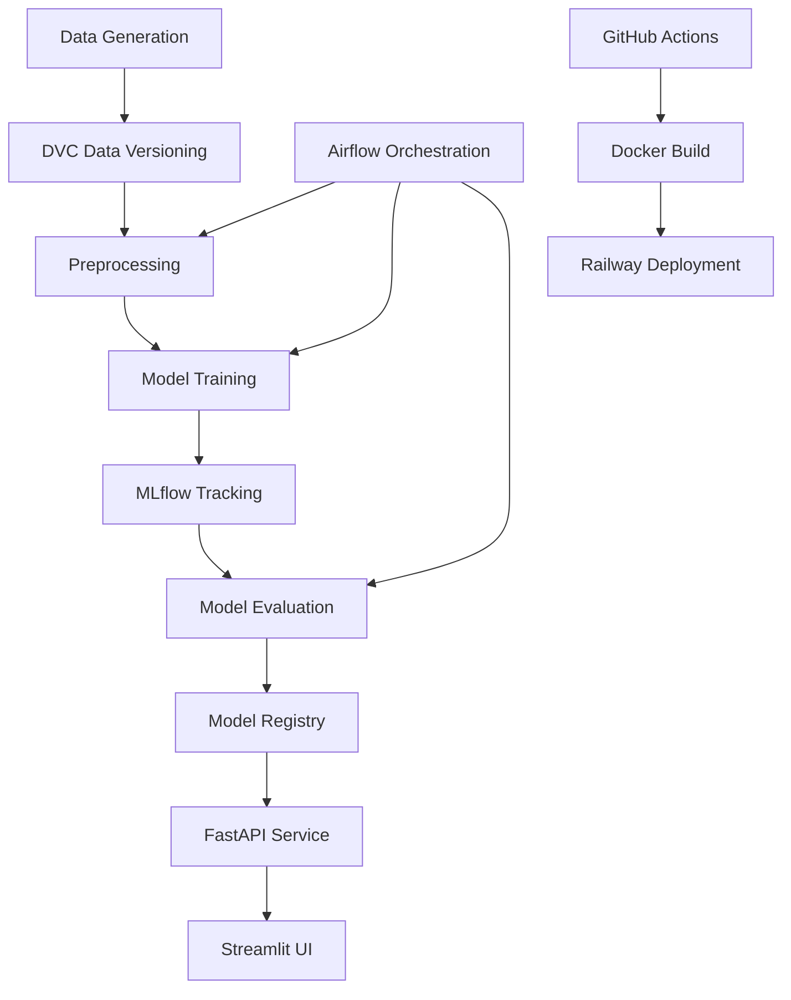

# 🎓 Student Placement Prediction MLOps System

A comprehensive **end-to-end MLOps pipeline** that predicts student placement outcomes using machine learning, demonstrating industry-best practices for ML workflow automation.


---

## 📋 Table of Contents

- [Overview](#overview)
- [Architecture](#architecture)
- [Technologies Used](#technologies-used)
- [Project Structure](#project-structure)
- [Installation & Setup](#installation--setup)
- [Usage Guide](#usage-guide)
- [MLOps Workflow](#mlops-workflow)
- [Deployment](#deployment)
- [Monitoring & Tracking](#monitoring--tracking)
- [Testing](#testing)
- [Troubleshooting](#troubleshooting)
- [Contributing](#contributing)
- [License](#license)

---

## 🌟 Overview

This project implements a complete **Machine Learning Operations (MLOps)** system for predicting whether a student will get placed based on their academic and skill profiles. It demonstrates the full lifecycle of an ML model from data generation to production deployment.

### Key Features

✅ **End-to-End MLOps Pipeline** - From data to deployment  
✅ **Automated Training** - Scheduled retraining with Apache Airflow  
✅ **Experiment Tracking** - Full MLflow integration  
✅ **Data Versioning** - DVC for reproducible data management  
✅ **REST API** - FastAPI backend with validation  
✅ **Interactive UI** - Production-grade Streamlit interface  
✅ **Containerization** - Docker-ready for cloud deployment  
✅ **CI/CD** - GitHub Actions automation  
✅ **Cloud Deployment** - Railway deployment ready  

---

## 🏗️ Architecture



### Workflow Components

1. **Data Layer**: Synthetic data generation with DVC versioning
2. **Training Layer**: Automated preprocessing, training, and evaluation
3. **Serving Layer**: FastAPI REST API with model inference
4. **UI Layer**: Streamlit web interface for predictions
5. **Orchestration**: Airflow DAGs for pipeline automation
6. **Deployment**: Docker containers with Railway hosting

---

## 🛠️ Technologies Used

| Category | Technology | Purpose |
|----------|-----------|---------|
| **ML Framework** | Scikit-learn | Logistic Regression model |
| **Experiment Tracking** | MLflow | Metrics, parameters, model registry |
| **Data Versioning** | DVC | Dataset and pipeline versioning |
| **Backend API** | FastAPI | RESTful prediction service |
| **Frontend UI** | Streamlit | Interactive prediction interface |
| **Orchestration** | Apache Airflow | Pipeline scheduling |
| **Containerization** | Docker | Application packaging |
| **CI/CD** | GitHub Actions | Automated testing and deployment |
| **Cloud Platform** | Railway | Production deployment |
| **Data Processing** | Pandas, NumPy | Data manipulation |
| **Visualization** | Plotly | Interactive charts |

---

## 📁 Project Structure

```
student-placement-mlops/
├── data/
│   ├── raw/                    # Raw dataset (DVC tracked)
│   └── processed/              # Processed train/test splits
├── src/
│   ├── __init__.py
│   ├── config.py               # Configuration settings
│   ├── generate_data.py        # Synthetic data generation
│   ├── data_preprocessing.py   # Data cleaning & splitting
│   ├── train.py                # Model training with MLflow
│   └── evaluate.py             # Model evaluation
├── app/
│   ├── __init__.py
│   ├── fastapi_app.py          # FastAPI REST API
│   └── streamlit_app.py        # Streamlit UI
├── airflow/
│   └── ml_pipeline_dag.py      # Airflow orchestration
├── tests/
│   └── test_model.py           # Unit tests
├── .github/workflows/
│   └── ci.yml                  # GitHub Actions CI/CD
├── models/                     # Trained models
├── mlruns/                     # MLflow tracking data
├── Dockerfile                  # API container
├── Dockerfile.streamlit        # UI container
├── docker-compose.yml          # Multi-container setup
├── railway.json                # Railway deployment config
├── Procfile                    # Process configuration
├── requirements.txt            # Python dependencies
├── params.yaml                 # Hyperparameters
├── dvc.yaml                    # DVC pipeline definition
├── .dvcignore                  # DVC ignore rules
├── .gitignore                  # Git ignore rules
└── README.md                   # This file
```

---

## 🚀 Installation & Setup

### Prerequisites

- Python 3.10+
- Docker (optional, for containerized deployment)
- Git
- Virtual environment tool (venv, conda, etc.)

### Local Installation

1. **Clone the repository**
   ```bash
   git clone https://github.com/yourusername/student-placement-mlops.git
   cd student-placement-mlops
   ```

2. **Create virtual environment**
   ```bash
   python -m venv venv
   
   # Windows
   venv\Scripts\activate
   
   # Linux/Mac
   source venv/bin/activate
   ```

3. **Install dependencies**
   ```bash
   pip install -r requirements.txt
   ```

4. **Generate dataset**
   ```bash
   python src/generate_data.py
   ```

5. **Run preprocessing**
   ```bash
   python src/data_preprocessing.py
   ```

6. **Train the model**
   ```bash
   python src/train.py
   ```

### Docker Installation

```bash
# Build and run all services
docker-compose up --build

# Or build individually
docker build -t placement-api .
docker build -f Dockerfile.streamlit -t placement-ui .
```

---

## 📖 Usage Guide

### Running the Complete Pipeline

#### Option 1: Manual Execution

```bash
# Step 1: Generate data
python src/generate_data.py

# Step 2: Preprocess data
python src/data_preprocessing.py

# Step 3: Train model
python src/train.py

# Step 4: Evaluate model
python src/evaluate.py
```

#### Option 2: Using DVC Pipeline

```bash
# Run entire DVC pipeline
dvc repro
```

#### Option 3: With Airflow (Scheduled)

```bash
# Start Airflow webserver
airflow webserver --port 8080

# Start Airflow scheduler
airflow scheduler
```

Access Airflow UI at: `http://localhost:8080`

### Running the API

```bash
# Development mode
uvicorn app.fastapi_app:app --reload --host 0.0.0.0 --port 8000

# Production mode
uvicorn app.fastapi_app:app --host 0.0.0.0 --port 8000 --workers 4
```

**API Endpoints:**

- `GET /` - API information
- `GET /health` - Health check
- `GET /model-info` - Model metadata
- `POST /predict` - Make prediction

**Example Prediction Request:**

```bash
curl -X POST "http://localhost:8000/predict" \
  -H "Content-Type: application/json" \
  -d '{
    "cgpa": 8.5,
    "internships": 3,
    "projects": 5,
    "coding_skills_score": 75,
    "communication_skills_score": 80
  }'
```

### Running the Streamlit UI

```bash
streamlit run app/streamlit_app.py --server.port 8501
```

Access the UI at: `http://localhost:8501`

---

## 🔄 MLOps Workflow

### 1. Data Management (DVC)

```bash
# Initialize DVC (already done)
dvc init

# Track dataset
dvc add data/raw/placement_data.csv

# Push to remote (configure remote first)
dvc push
```

### 2. Experiment Tracking (MLflow)

All experiments are automatically logged to MLflow:

- **Parameters**: Model hyperparameters, data split ratios
- **Metrics**: Accuracy, Precision, Recall, F1-Score, ROC-AUC
- **Artifacts**: Trained models, confusion matrices
- **Registry**: Production-ready models

**View MLflow UI:**
```bash
mlflow ui --port 5000
```

Access at: `http://localhost:5000`

### 3. CI/CD Pipeline (GitHub Actions)

The CI/CD pipeline automatically:

1. Runs unit tests
2. Executes training pipeline
3. Builds Docker images
4. Deploys to Railway (on main branch)

**Triggered by:**
- Push to `main` or `develop`
- Pull requests

### 4. Model Lifecycle

```
Data Generation → Preprocessing → Training → Evaluation → Registry → Deployment
```

Each stage is versioned and tracked for reproducibility.

---

## ☁️ Deployment

### Railway Deployment

1. **Install Railway CLI**
   ```bash
   npm install -g @railway/cli
   ```

2. **Login to Railway**
   ```bash
   railway login
   ```

3. **Initialize project**
   ```bash
   railway init
   ```

4. **Deploy**
   ```bash
   railway up
   ```

5. **Set environment variables**
   ```bash
   railway variables set FASTAPI_ENV=production
   ```

### Docker Deployment

```bash
# Build image
docker build -t placement-api .

# Run container
docker run -p 8000:8000 placement-api

# Push to registry
docker tag placement-api your-registry/placement-api:latest
docker push your-registry/placement-api:latest
```

### Docker Compose (Full Stack)

```bash
# Start all services
docker-compose up -d

# View logs
docker-compose logs -f

# Stop services
docker-compose down
```

Services available at:
- FastAPI: `http://localhost:8000`
- Streamlit: `http://localhost:8501`
- MLflow: `http://localhost:5000` (with `full` profile)

---

## 📊 Monitoring & Tracking

### MLflow Metrics

Track the following metrics:

- **Training Metrics**: Accuracy, Precision, Recall, F1-Score
- **Test Metrics**: All training metrics + ROC-AUC
- **Confusion Matrix**: TP, TN, FP, FN
- **Model Parameters**: Regularization, iterations, random state

### Airflow Monitoring

Monitor pipeline execution:

1. Access Airflow UI: `http://localhost:8080`
2. View DAG runs and task status
3. Check logs for each task
4. Set up email alerts for failures

### Application Logs

```bash
# View FastAPI logs
docker logs placement-api

# View Streamlit logs
docker logs placement-ui
```

---

## 🧪 Testing

### Run All Tests

```bash
pytest tests/ -v
```

### Run Specific Test Class

```bash
pytest tests/test_model.py::TestDataGeneration -v
```

### Test Coverage

```bash
pytest --cov=src tests/
```

### Test Categories

- **Unit Tests**: Individual components (data generation, preprocessing)
- **Integration Tests**: Full pipeline workflow
- **API Tests**: FastAPI endpoints (requires running server)

---

## 🔧 Troubleshooting

### Common Issues

#### 1. Module Import Errors

```bash
# Ensure you're in the project root
export PYTHONPATH=$(pwd):$PYTHONPATH

# Or install in development mode
pip install -e .
```

#### 2. MLflow Tracking Issues

```bash
# Check MLflow URI
export MLFLOW_TRACKING_URI=file:./mlruns

# Or use Dagshub
export MLFLOW_TRACKING_URI=https://dagshub.com/your-repo.mlflow
```

#### 3. Docker Build Failures

```bash
# Clear Docker cache
docker system prune -a

# Rebuild without cache
docker build --no-cache -t placement-api .
```

#### 4. Port Already in Use

```bash
# Find process using port 8000
lsof -i :8000

# Kill process
kill -9 <PID>

# Or use different port
uvicorn app.fastapi_app:app --port 8001
```

#### 5. DVC Remote Configuration

```bash
# Setup DVC remote (example with S3)
dvc remote add -d myremote s3://mybucket/dvcstore

# Or use local remote for testing
dvc remote add -d myremote ./dvc_remote
```

---

## 🤝 Contributing

We welcome contributions! Please follow these steps:

1. Fork the repository
2. Create a feature branch (`git checkout -b feature/amazing-feature`)
3. Commit your changes (`git commit -m 'Add amazing feature'`)
4. Push to the branch (`git push origin feature/amazing-feature`)
5. Open a Pull Request

### Code Standards

- Follow PEP 8 guidelines
- Write docstrings for all functions
- Add type hints where applicable
- Include tests for new features
- Update documentation as needed

---

## 📄 License

This project is licensed under the MIT License - see the LICENSE file for details.

---

## 👥 Authors

- Your Name - Initial work - [@yourhandle](https://github.com/yourhandle)

---

## 🙏 Acknowledgments

- Scikit-learn team for the ML library
- MLflow team for experiment tracking
- FastAPI team for the amazing framework
- Streamlit team for the UI framework
- Apache Airflow team for orchestration

---

## 📞 Support

For issues and questions:

- Create an issue on GitHub
- Email: support@example.com
- Join our Discord community

---

## 🎯 Future Enhancements

- [ ] Add multiple model support (Random Forest, XGBoost)
- [ ] Implement model monitoring in production
- [ ] Add A/B testing framework
- [ ] Integrate with real placement datasets
- [ ] Add explainability with SHAP/LIME
- [ ] Implement drift detection
- [ ] Add model retraining triggers
- [ ] Kubernetes deployment support

---

**Made with ❤️ for the MLOps Community**

⭐ Star this repo if you find it helpful!
